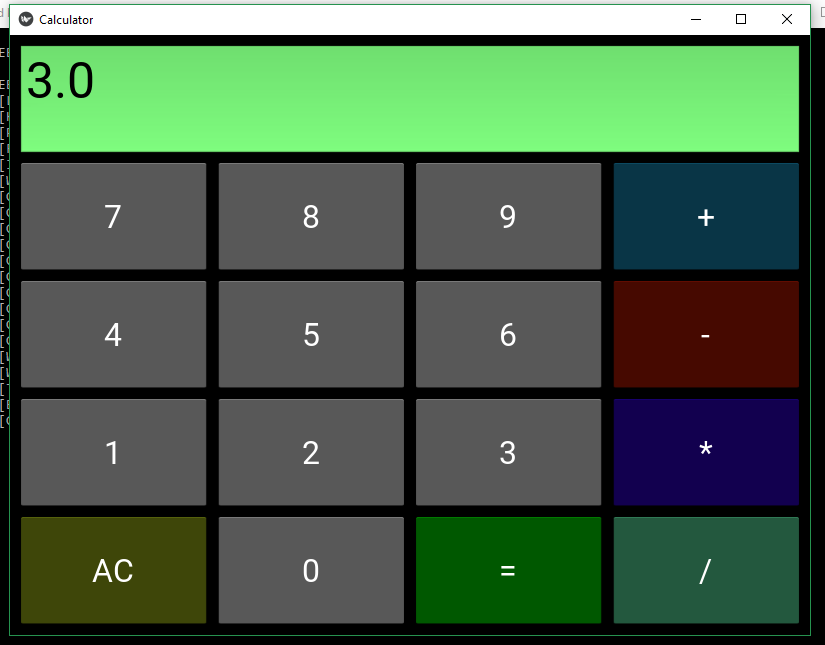

# Calculator
Fully Functional Calculator with Natural User Interface(NUI) using Kivy

This is a fully functionl calculator that makes use of addition, subtraction, multiplication and division.

**Output**

The following photos shows the outputs:

**Resources used**

Kivy:

For this calculator, I used Kivy which is an open source Python library for developing mobile apps and other multitouch application software with a natural user interface. You can install kivy by going to https://kivy.org/#download to follow the installation process for different operating systems. You will be directed to intall some additional packages which helps kivy function well on your system. So hop in there and install kivy in order to be able to use this calculator.
